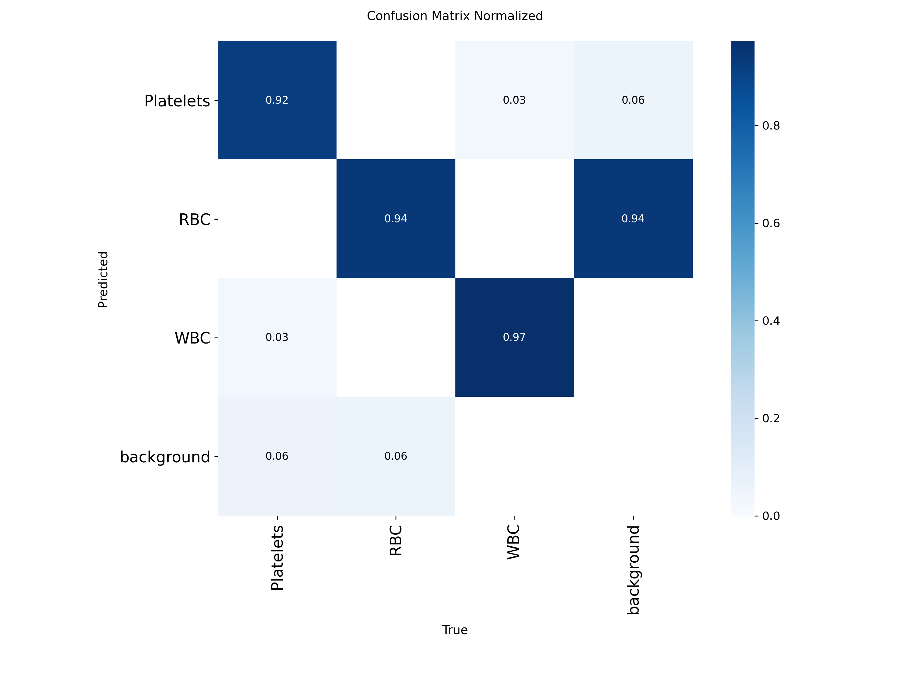
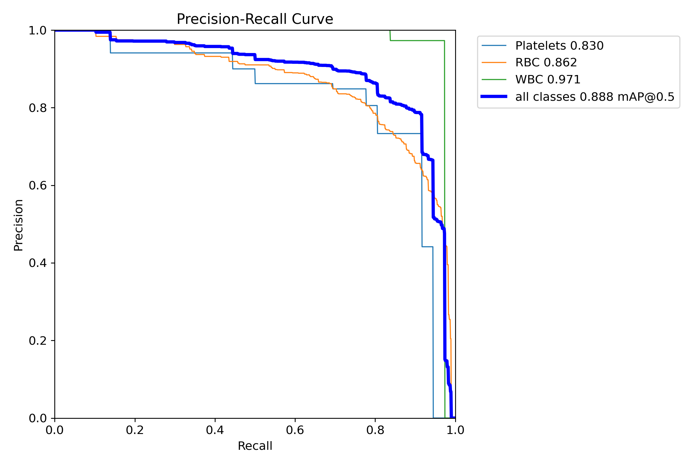

## Contents
- [Overview](#overview)
- [Dataset](#dataset)
- [Methodology](#methodology)
- [Results](#results)
- [Key Learnings](#key-learnings)
- [Project Structure](#project-structure)
- [Running the Project](#running-the-project)
- [Future Improvements](#future-improvements)
- [Credits](#credits)

## Overview
This project detects and classifies blood cells in microscope images using a custom-trained YOLOv8 model and provides an interactive Streamlit interface for visualizing predictions.
* Red Blood Cells (RBC)
* White Blood Cells (WBC)
* Platelets

The goal is to explore how modern computer vision techniques can support automated and low-cost blood analysis.

---

## Dataset
**[BCCD (Blood Cell Count Dataset)](https://public.roboflow.com/object-detection/bccd)**
* 874 annotated microscope images
* 3 object classes (RBC, WBC, Platelets)
* Exported and managed using [Roboflow](https://roboflow.com)

---

## Technologies Used

- Python
- PyTorch
- Ultralytics YOLOv8
- OpenCV
- Roboflow
- Streamlit
- Google Colab

---


## Methodology

### Model
* YOLOv8n (Nano)
* Initialized from COCO-pretrained weights

### Why Transfer Learning?
Training an object detector from scratch requires large amounts of labeled data and computational resources. By starting from COCO-pretrained weights, the model already understands generic visual patterns such as edges, shapes, and textures.

Fine-tuning on the BCCD dataset allows the detector to adapt these learned features to medical images while requiring significantly less data and training time.

### Training Configuration
| Parameter  | Value                            |
| ---------- | --------------------------------- |
| Model      | YOLOv8n                          |
| Epochs     | 100                               |
| Image Size | 416 * 416                         |
| Batch Size | 16                                 |
| Optimizer  | Default YOLOv8 Training Pipeline  |

---

## Results

### Training Curves


### Test Set Performance
| Metric       | Score |
| ------------ | ----- |
| mAP@0.5      | 0.888 |
| mAP@0.5:0.95 | 0.605 |
| Precision    | 0.857 |
| Recall       | 0.848 |
| F1 Score     | 0.853 |

### Confusion Matrix & Precision-Recall Curve



### Per-Class AP@0.5
| Class     | AP@0.5 |
| --------- | ------ |
| Platelets | 0.83   |
| RBC       | 0.86   |
| WBC       | 0.97   |

White Blood Cells achieved the highest detection performance because their large size and distinctive nucleus make them visually easier to identify. Red Blood Cells were the most challenging due to frequent overlap and dense clustering.

---

## Key Learnings
* Class imbalance becomes more apparent when examining per-class metrics rather than only overall performance.
* mAP@0.5:0.95 provides a more rigorous evaluation than mAP@0.5 because it rewards accurate localization across multiple IoU thresholds.
* Dataset exports should always be verified before training. During this project, class labels were exported as placeholder indices instead of human-readable names, requiring manual validation of the `data.yaml` configuration.

---

## Project Structure
```text
blood-cell-detection-yolov8/
│
├── README.md
├── requirements.txt
│
├── notebooks/
│   └── yolov8_bccd_training.ipynb
│
├── src/
│   └── streamlit_app.py
│
├── weights/
│   └── best.pt
│
└── results/
    ├── sample_predictions.png
    ├── confusion_matrix_normalized.png
    ├── BoxPR_curve.png
    └── results.png
```

---

## Running the Project
Install dependencies:
```bash
pip install -r requirements.txt
```

Launch the Streamlit application:
```bash
streamlit run src/streamlit_app.py
```

Upload a microscope image to visualize blood cell detections produced by the trained YOLOv8 model.

---

## Future Improvements
* Train larger YOLOv8 variants (YOLOv8s / YOLOv8m)
* Apply advanced augmentation techniques
* Address class imbalance using weighted sampling
* Evaluate on additional hematology datasets
* Deploy as a web-based diagnostic support tool

---

## Credits
Built on [Ultralytics YOLOv8](https://github.com/ultralytics/ultralytics). Dataset via [Roboflow](https://roboflow.com).

## License
This project is licensed under the MIT License.
